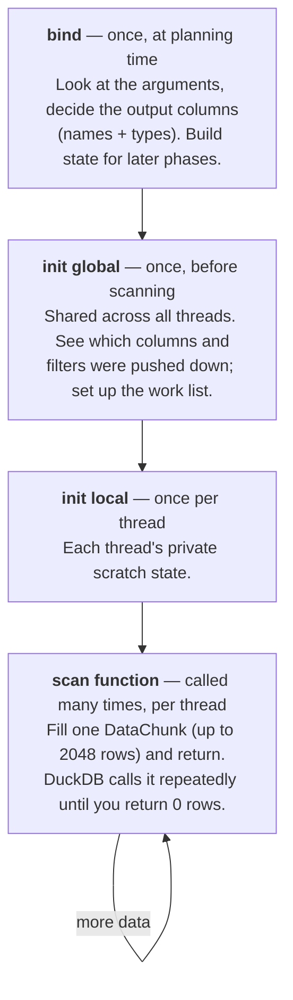

# arena-duckdb: a code walkthrough

A guided tour of the C++ extension for someone who knows what the code is *for* but wants to
understand *how* it works — and who hasn't written C++ in a while. It explains the architecture, the
DuckDB machinery, and the C++ idioms as they come up.

Read it top to bottom the first time; after that it works as a reference.

---

## 1. The big picture

The extension answers one question: **how does DuckDB run SQL over an arena shared-memory segment?**
There are two layers, deliberately kept separate:

```
   ┌─────────────────────────────────────────────────────────────┐
   │  Layer 2 — the DuckDB glue   (src/scan/)                      │
   │  arena_scan.cpp, arena_extension.cpp                          │
   │  Knows about DuckDB: table functions, vectors, pushdown.      │
   └───────────────────────────────┬─────────────────────────────┘
                                    │ uses
   ┌───────────────────────────────▼─────────────────────────────┐
   │  Layer 1 — the reader core   (src/format/)                   │
   │  segment_reader, schema, layout, mapped_file, sha256         │
   │  Pure C++17. NO DuckDB dependency. Just: given segment bytes, │
   │  hand back typed column values.                               │
   └──────────────────────────────────────────────────────────────┘
```

**Why the split matters.** `src/format/` has zero `#include "duckdb.hpp"`. It's a standalone,
reusable "libarena-reader" — you could drop it into any C++ program. All the DuckDB-specific code
lives in `src/scan/`. When you read the code, always know which layer you're in: Layer 1 deals in
raw bytes and `std::` types; Layer 2 deals in `duckdb::` types.

The data flow for a query like `SELECT sym, px FROM arena_scan('/path/seg.arena') WHERE px > 100`:

```
 file on disk ──mmap──► raw bytes ──reader core──► typed values ──scan──► DuckDB vectors ──► SQL engine
                        (Layer 1)                  (Layer 1)     (Layer 2)
```

---

## 2. A five-minute C++ refresher

These idioms show up constantly. Skim now, refer back later.

| Idiom | What it means |
|---|---|
| `namespace arena { … }` | A named scope. `arena::SegmentReader` is the full name. Layer 1 is in `namespace arena`, Layer 2 in `namespace duckdb`. |
| `namespace { … }` (no name) | *Anonymous namespace* = "private to this .cpp file" (internal linkage). Most helper functions live here. |
| `#pragma once` | Header include guard — "only paste this header in once per file." |
| `const T&` (reference) | An alias to an existing object, no copy. `const` = read-only. Passing big structs by `const&` avoids copying them. |
| `T*` (pointer) | An address; can be null. Reader-core APIs return `const uint8_t*` into the mmap. |
| `unique_ptr<T>` | A pointer that *owns* its object and frees it automatically when it goes out of scope (RAII). Can't be copied, only *moved*. |
| `std::move(x)` | "I'm done with `x` here — transfer its guts to the destination instead of copying." Needed to return a `unique_ptr`. |
| `auto` | "Compiler, infer the type." `auto x = foo();` |
| `auto [a, b] = pair;` | *Structured binding* (C++17): unpack a pair/tuple into named variables. |
| `template <class T> …` | A function/type parameterized by a type, stamped out per `T` at compile time. |
| `static_assert(cond, msg)` | Compile-time check; build fails if `cond` is false. |
| `memcpy(&dst, src, n)` | Copy `n` raw bytes. Used here for *alignment-safe* and *type-pun* reads (see §3.2). |
| `reinterpret_cast<T>(p)` | "Treat this pointer's bits as a `T*`." No conversion, just a relabel. |
| `x >> 3`, `x & 7` | Bit ops: `>>3` divides by 8, `&7` takes the low 3 bits — used to find a bit inside a byte. |

DuckDB adds a few of its own wrappers (all in `namespace duckdb`):

| DuckDB idiom | What it means |
|---|---|
| `make_uniq<T>(args)` | DuckDB's `std::make_unique` — construct a `T` and wrap it in a `unique_ptr`. |
| `obj.Cast<Derived>()` | A checked-ish `static_cast` from a DuckDB base class to a derived one (used to get *your* subclass back out of DuckDB's base pointers). |
| `optional_ptr<T>` | A pointer that may be null but is more explicit about it than a bare `T*`. |
| `idx_t` | DuckDB's unsigned index/size type (like `size_t`). |
| `override` | Marks a method that overrides a virtual base method — compiler verifies it really does. |

---

## 3. Layer 1 — the reader core (`src/format/`)

### 3.1 The byte contract (`arena_format.hpp`)

Everything starts from the segment's on-disk layout, defined in `docs/segment-format.md`. This header
mirrors it as compile-time constants:

```cpp
inline constexpr char MAGIC[8] = {'A','R','E','N','A','F','M','T'};
inline constexpr int  HEADER_LENGTH = 4096;
inline constexpr int  HDR_SCHEMA_SHA256 = 16;   // byte offset of the 32-byte hash
inline constexpr int  HDR_ACTIVE_BATCH_COUNT = 192;
inline constexpr int  CATALOG_ENTRY_SIZE = 64;  // one cache line per batch
```

`inline constexpr` = "a true compile-time constant that's safe to define in a header." The `HDR_*`
and `ENT_*` names are **byte offsets** into the header / catalog entries. Reading the format is
mostly "go to offset X and interpret the bytes."

The first thing the header does is refuse to run on the wrong kind of machine:

```cpp
static_assert(__BYTE_ORDER__ == __ORDER_LITTLE_ENDIAN__,
              "the arena format is little-endian; a big-endian host would need byte swapping");
```

The format stores integers little-endian. x86-64 and ARM are little-endian, so we can read bytes
straight into an integer with no swapping — and this `static_assert` guarantees the build fails
loudly on a big-endian host instead of silently returning garbage.

### 3.2 Alignment-safe reads: `load_le`

```cpp
template <class T>
inline T load_le(const std::uint8_t* base, std::size_t offset = 0) {
    T value;
    std::memcpy(&value, base + offset, sizeof(T));
    return value;
}
```

This is *the* workhorse for reading the format. It's a template, so `load_le<int64_t>(p, 48)` reads 8
bytes and `load_le<int32_t>(p, 8)` reads 4.

Why `memcpy` instead of `*reinterpret_cast<const int64_t*>(base + offset)`? Two reasons:

1. **Alignment.** Dereferencing an `int64_t*` that isn't 8-byte aligned is *undefined behaviour* in
   C++. Our offsets come from a file and may not be aligned. `memcpy` has no alignment requirement,
   and the compiler optimizes it to a single load when it's safe — so it's free *and* correct.
2. **Type punning.** Reinterpreting bytes as a different type through a pointer also violates C++'s
   strict-aliasing rule. `memcpy` is the blessed way to say "reinterpret these bytes as a `T`."

Remember this pattern — it's why you'll see `memcpy` all over a codebase that "just reads structs."

### 3.3 The concurrency contract: `acquire_i64`

The arena is written by a *live* process while we read it. Three fields change under our feet:
`active_batch_count`, each batch's `length`, and the `heartbeat`. These are read with **acquire
semantics**:

```cpp
inline std::int64_t acquire_i64(const std::uint8_t* base, std::size_t offset) {
    const std::int64_t* p = reinterpret_cast<const std::int64_t*>(base + offset);
    return __atomic_load_n(p, __ATOMIC_ACQUIRE);
}
```

`__atomic_load_n(..., __ATOMIC_ACQUIRE)` is a GCC/Clang builtin for an *atomic acquire load*. The
mental model: the writer does plain writes to a batch's data and stats, then a **release** store to
that batch's `length` to publish it. Our **acquire** load of `length` is guaranteed to see all those
earlier writes. So once we've acquire-loaded a non-zero `length`, the batch's bytes below that row
count are safe to read — no torn reads, no half-written rows. (This mirrors the Java writer's
`VarHandle` release/acquire on the same fields.)

**Wait — didn't §3.2 insist on `memcpy` for alignment safety?** It did, so the `reinterpret_cast`
here looks like a contradiction. It isn't: `load_le` and `acquire_i64` have different jobs.

`memcpy` fundamentally can't perform this read. It's a plain byte copy with no atomicity or ordering
guarantees — the compiler may even do it byte-by-byte. An *atomic acquire load* is the entire point
of this function, and the only way to get one is `__atomic_load_n(p, __ATOMIC_ACQUIRE)`, which takes
a real `const int64_t*`. The typed pointer isn't a shortcut; it's the required shape of an atomic
load.

And it's safe here because an atomic load **must be naturally aligned to actually be atomic** (an
8-byte atomic that straddles a cache line isn't) — so alignment is mandatory, not optional, and the
format guarantees it: `mmap` hands back a page-aligned `base`, and every ordered field sits at an
8-aligned offset (`heartbeat` at 128, `active_batch_count` at 192, each catalog `length` at
`catalog_offset + k*64`). So `base + offset` is always 8-byte aligned — the precondition the
`reinterpret_cast` needs is guaranteed by construction.

The contrast in one line each:

- **`load_le`** — a *plain* read, used for fields all over the format. No atomicity needed, so
  `memcpy` is the defensive default: it sidesteps *both* alignment and strict-aliasing concerns for
  free, with no case-by-case proof.
- **`acquire_i64`** — needs atomicity + ordering, which forces a typed pointer, which forces
  alignment — a debt the format is deliberately laid out to have already paid.

(Why not the modern `std::atomic_ref`? It needs a *mutable* reference to the object, but our mapping
is read-only `const`; the builtin loads cleanly through a `const` pointer and gives the same acquire
semantics.)

The `length` field also packs two things into one 64-bit word:

```cpp
inline constexpr std::int64_t IN_PROGRESS_BIT = std::int64_t{1} << 63;   // top bit
inline constexpr std::int64_t ROW_COUNT_MASK  = 0x7fffffffffffffffLL;    // the other 63 bits

inline std::int64_t row_count_of(std::int64_t length) { return length & ROW_COUNT_MASK; }
inline bool         is_in_progress(std::int64_t length){ return (length & IN_PROGRESS_BIT) != 0; }
```

Bit 63 = "this batch is still being written"; the low 63 bits = the row count. `&` (bitwise AND)
with the mask extracts one without the other. A sealed batch has bit 63 clear.

### 3.4 The mapping wrapper: ownership without a garbage collector (`mapped_file.hpp`)

Before `segment_reader` reads anything, `MappedFile` has to `mmap` the file and — crucially — make
sure it gets `munmap`ped *exactly once*, no matter how the object is passed around. This is the piece
most likely to feel alien coming from Java, and it's the template for how every resource in the
codebase is owned, so it's worth its own section.

**Declaring a variable constructs a whole object.** In Java, `MappedFile m;` would be a null
reference until you `new`. In C++ it *is* the object — built on the stack, alive immediately, no
`new` — as the factory `MappedFile::open` shows at its end:

```cpp
MappedFile m;                        // fully constructed right here
m.data_ = static_cast<const std::uint8_t*>(addr);
m.size_ = size;
return m;
```

And it's not uninitialised before those assignments, because the members carry **default member
initializers**:

```cpp
private:
    const std::uint8_t* data_ = nullptr;   // starts null
    std::size_t         size_ = 0;         // starts zero
```

So `MappedFile m;` runs the defaulted constructor and `m` begins life as `{nullptr, 0}` — a valid,
empty mapping — before the assignments overwrite it with the real one. (`open` may touch those
`private` members because access in C++ is per-class, not per-instance: any member may touch any
instance's privates.)

**The ownership invariant.** The destructor states the rule in code — "a non-null `data_` means I own
a mapping and must release it":

```cpp
MappedFile::~MappedFile() {
    if (data_ != nullptr) ::munmap(const_cast<std::uint8_t*>(data_), size_);
}
```

That destructor runs *automatically* whenever a `MappedFile` goes out of scope — the RAII guarantee
that stands in for Java's `finally`/GC. Everything else in the class exists to keep that invariant
true (exactly one owner per mapping) as objects are moved and returned.

**Copy is forbidden; move transfers ownership.** A memberwise copy would give two objects the same
`data_`, so *both* destructors would `munmap` it — a double-free. So copy is deleted and move is
defined instead. (Spelling out all five special members like this is the **Rule of Five**: once you
write a destructor to free a resource, you must take control of copy and move too, or the
compiler-generated versions will do the wrong thing.)

```cpp
MappedFile(const MappedFile&)            = delete;   // no copying — would double-free
MappedFile(MappedFile&& other) noexcept              // move = steal the handle, blank the source
    : data_(other.data_), size_(other.size_) {
    other.data_ = nullptr;
    other.size_ = 0;
}
```

A move copies the pointer into the destination and then **nulls the source**, so when the source is
destroyed its `data_` is `nullptr` and its destructor skips the `munmap`. Ownership *moves* rather
than duplicating — always exactly one live owner.

**Why `return m;` works.** Two things can happen, both correct:

- **NRVO** (named return value optimization — what release builds do here): the compiler constructs
  `m` *directly in the caller's storage*, so `m` and the caller's variable are literally the same
  object — no move, no copy at all.
- **Otherwise**: the return move-constructs the result from `m` (stealing the mapping, nulling `m`),
  then `m` is destroyed harmlessly. The language treats a returned local as an rvalue for this
  purpose, which is why it selects the *move* constructor — and why the code compiles at all even
  though copy is deleted. (NRVO is permitted but not guaranteed, so the move constructor must exist
  as the fallback.)

**It composes.** Because `MappedFile` is movable, anything containing one is automatically movable.
`SegmentReader` holds a `MappedFile file_`, so `SegmentReader::open` can return by value and
`bind->readers.push_back(SegmentReader::open(seg))` (§4.2) *moves* the reader — mapping and all —
into the vector. At end of query the vector is destroyed, each `MappedFile` destructor fires once,
and each segment is `munmap`ped exactly once. The whole chain — mmap → `MappedFile` → `SegmentReader`
→ `vector` → bind data — is cleaned up automatically, with no manual `close()` anywhere.

### 3.5 Opening and freezing a segment (`segment_reader.cpp`)

`SegmentReader::open(path)` is the heart of Layer 1. It's a **static factory** — a static method that
constructs and returns a fully-initialized object — so callers can't get a half-open reader.

```cpp
SegmentReader SegmentReader::open(const std::string& path) {
    SegmentReader r;
    r.file_ = MappedFile::open(path);            // mmap the file read-only
    const std::uint8_t* base = r.file_.data();
    ...
```

`MappedFile` (§3.4) wraps `mmap` in RAII; `r.file_ = MappedFile::open(path)` move-assigns the mapping
into the reader, and it's `munmap`ped automatically when the `SegmentReader` is destroyed. `base` is a
pointer to the first byte of the file, now visible as memory.

**Step 1 — validate.** Check the file is at least a header long, the magic matches, and the version
is one we understand:

```cpp
if (std::memcmp(base + HDR_MAGIC, MAGIC, MAGIC_LENGTH) != 0)
    throw FormatError("bad segment magic: " + path);
```

`memcmp` returns 0 when the bytes are equal. `throw` raises a C++ exception — Layer 2 catches these
and turns them into DuckDB errors (§4.4).

**Step 2 — verify the schema hash.** This is the most important safety check:

```cpp
auto digest = sha256(base + hi.schema_offset, hi.schema_length);
if (std::memcmp(digest.data(), base + HDR_SCHEMA_SHA256, SHA256_LENGTH) != 0)
    throw FormatError("schema hash mismatch: ...");
```

The header stores a SHA-256 of the embedded schema. We recompute it and compare. Why bother? Because
the *worst* possible failure for a binary format reader is to misread the layout and return
plausible-looking garbage. A hash mismatch means "these bytes aren't what the header claims" — we
fail hard rather than hand back wrong numbers.

**Step 3 — freeze a snapshot.** This is the subtle bit and the reason reads are consistent:

```cpp
hi.active_batch_count = acquire_i64(base, HDR_ACTIVE_BATCH_COUNT);   // once
for (int k = 0; k < count; ++k) {
    std::int64_t entry  = hi.catalog_offset + k * CATALOG_ENTRY_SIZE;
    std::int64_t length = acquire_i64(base, entry + ENT_LENGTH);     // once per batch
    BatchInfo b;
    b.row_count = row_count_of(length);
    b.sealed    = !is_in_progress(length);
    b.base_offset = load_le<std::int64_t>(base, entry + ENT_BASE_OFFSET);
    b.ts_min = load_le<std::int64_t>(base, entry + ENT_TS_MIN);
    ... // ts_max, stat_min, stat_max, seal_nanos
    r.batches_.push_back(b);
}
return r;
```

We acquire-load `active_batch_count` **once**, then each batch's `length` **once**, and never re-read
them. That's the "snapshot": from here on, the reader sees a fixed set of batches with fixed row
counts. The live writer may add more rows or batches afterwards — this reader simply won't see them,
which is exactly the consistent cut we want for one query. (A *new* query opens a *new* reader and
sees a fresh snapshot — that's how the live demo shows the row count growing.)

Note the ordering: we acquire-load `length` *first*, and only then plainly `load_le` the
`base_offset` and stats. Because the writer released `length` last, seeing the new `length` means the
stats and offset it published are already visible. Order matters.

### 3.6 The value accessors — reading a single cell

The header (`segment_reader.hpp`) exposes a handful of accessors. They all follow the same shape:
find the batch's base address, add the column's offset, index by row.

```cpp
const std::uint8_t* SegmentReader::fixed_ptr(int batch, int row, int col) const {
    const ColumnLayout& c = column(col);
    return batch_base(batch) + c.data_offset + std::int64_t(row) * c.element_width;
}
```

`batch_base(batch)` is `file_.data() + batches_[batch].base_offset`. Add the column's `data_offset`
(where this column's data starts within the batch) and skip `row * element_width` bytes. The result
is a pointer straight into the mmap — **no copy**. On top of `fixed_ptr` sits a template that reads a
typed value:

```cpp
template <class T>
T fixed(int batch, int row, int col) const {
    T v;
    std::memcpy(&v, fixed_ptr(batch, row, col), sizeof(T));   // same alignment-safe trick
    return v;
}
```

Two accessors do bit-twiddling. **Validity** (is this cell non-null?) is a bitmap — one bit per row:

```cpp
bool SegmentReader::is_valid(int batch, int row, int col) const {
    const std::uint8_t* validity = batch_base(batch) + column(col).validity_offset;
    return (validity[row >> 3] & (1u << (row & 7))) != 0;
}
```

`row >> 3` is `row / 8` (which byte), `row & 7` is `row % 8` (which bit in that byte). `1u << (row&7)`
makes a mask with just that bit set; `&` tests it. `boolean(...)` is identical but reads the *data*
bitmap instead of the validity bitmap (booleans are themselves stored as one bit per row).

**Variable-length** values (strings, blobs) use an Arrow-style offsets array — offset `i` and `i+1`
bracket row `i`'s bytes:

```cpp
std::pair<const std::uint8_t*, std::int32_t> SegmentReader::varlen(int batch, int row, int col) const {
    const std::uint8_t* bb = batch_base(batch);
    const std::uint8_t* offsets = bb + column(col).offsets_offset;
    std::int32_t o0 = load_le<std::int32_t>(offsets, row * 4);        // start of row
    std::int32_t o1 = load_le<std::int32_t>(offsets, (row + 1) * 4);  // start of next row
    return {bb + column(col).data_offset + o0, o1 - o0};              // {pointer, length}
}
```

It returns a `std::pair` of `{pointer into the data blob, length in bytes}` — again, zero copy.

### 3.7 The decoded schema and layout (`schema.hpp`, `layout.hpp`)

Two small structs describe a column, from two different regions of the segment:

- **`ColumnType`** (`schema.hpp`) — the *logical* type, decoded from the embedded Arrow schema:
  the `LogicalType` enum (`INT64`, `DECIMAL128`, `TIMESTAMP`, `UTF8`, …), plus `decimal_precision`,
  `decimal_scale`, `timestamp_unit`, `timezone`. This is what SQL cares about.
- **`ColumnLayout`** (`layout.hpp`) — the *physical* byte layout within a batch: `element_width`,
  `validity_offset`, `data_offset`, `offsets_offset`, and a `PhysicalKind` (`FIXED`, `VARLEN`,
  `BOOL_BITMAP`). This is what the accessors in §3.6 use.

The separation is deliberate: the layout descriptor is enough to *read bytes*, but not to know they
mean a `DECIMAL(18,4)` vs a plain `int64`. The Arrow schema fills that in. `TableSchema` also carries
`time_column` and `stats_column` — the names of the columns the zone-map stats are kept for (§4.5).

That's the whole reader core: **mmap → verify → freeze snapshot → hand out typed pointers.** No
DuckDB in sight. Now we build the SQL surface on top.

---

## 4. Layer 2 — the DuckDB scan (`src/scan/arena_scan.cpp`)

### 4.1 The mental model: a table function's lifecycle

A DuckDB *table function* is a function you can put in a `FROM` clause. DuckDB calls your code back
at four well-defined moments. This is the single most important thing to understand:



Each phase gets its own function and (usually) its own state struct. In `arena_scan.cpp`:

| Phase | Function | State struct it creates |
|---|---|---|
| bind | `ArenaScanBind` | `ArenaScanBindData` |
| init global | `ArenaScanInitGlobal` | `ArenaScanGlobalState` |
| init local | `ArenaScanInitLocal` | `ArenaScanLocalState` |
| scan | `ArenaScanFunc` | — (uses the three above) |

They're wired together at the very bottom of the file:

```cpp
void RegisterArenaScan(ExtensionLoader &loader) {
    TableFunction scan("arena_scan", {LogicalType::VARCHAR},   // name + one VARCHAR argument
                       ArenaScanFunc, ArenaScanBind, ArenaScanInitGlobal, ArenaScanInitLocal);
    scan.projection_pushdown = true;   // "only ask me for the columns you need"
    scan.filter_pushdown = true;       // "tell me the WHERE predicates"
    loader.RegisterFunction(scan);
}
```

Those two `= true` flags opt into the optimizations in §4.5–4.7. Setting them is a *promise*: if you
accept pushed-down filters, you must apply them (§4.7).

### 4.2 `bind` — deciding the shape of the output

```cpp
unique_ptr<FunctionData> ArenaScanBind(ClientContext &, TableFunctionBindInput &input,
                                       vector<LogicalType> &return_types, vector<string> &names) {
    auto path = input.inputs[0].GetValue<string>();     // the VARCHAR argument
    auto bind = make_uniq<ArenaScanBindData>();
```

`bind` is a `unique_ptr<ArenaScanBindData>` — the state object DuckDB will hand back to every later
phase. `ArenaScanBindData` (defined just above) holds everything the scan needs to remember:

```cpp
struct ArenaScanBindData : public TableFunctionData {   // ": public" = inherits from DuckDB's base
    std::vector<arena::SegmentReader> readers;   // the open mmaps (Layer 1)
    arena::TableSchema schema;                   // decoded column types
    std::vector<Work> work;                      // the (segment, batch) to-do list
    int time_ordinal = -1;
    int stats_ordinal = -1;
};
```

Inheriting from `TableFunctionData` is what lets DuckDB store it behind a base-class pointer and hand
it back to us later (we recover our type with `.Cast<ArenaScanBindData>()`).

Bind does four things:

```cpp
    for (auto &seg : ResolveSegmentPaths(path))              // 1. open every segment
        bind->readers.push_back(arena::SegmentReader::open(seg));

    auto [schema_ptr, schema_len] = bind->readers[0].embedded_schema();   // 2. decode the schema
    bind->schema = arena::TableSchema::decode(schema_ptr, schema_len);
    bind->time_ordinal  = find_column(bind->schema, bind->schema.time_column);
    bind->stats_ordinal = ...;

    for (int ri = 0; ri < (int)bind->readers.size(); ++ri)   // 3. build the work list
        for (auto &b : bind->readers[ri].batches())
            if (b.row_count > 0)                              // skip the empty trailing batch
                bind->work.push_back(Work{ri, b.index, b.row_count, b.sealed,
                                          b.ts_min, b.ts_max, b.stat_min, b.stat_max});

    for (auto &col : bind->schema.columns) {                  // 4. declare output columns
        names.push_back(col.name);
        return_types.push_back(MapType(col));
    }
    return std::move(bind);
```

`ResolveSegmentPaths` returns either one file or every `.arena` file in a directory. A **`Work`** item
is one (segment, batch) pair plus its zone-map stats copied out — the unit of parallelism (§4.6).
`names`/`return_types` are *out-parameters* (passed by reference for us to fill): this is how bind
tells DuckDB the result schema. Finally `return std::move(bind)` hands ownership of our state to
DuckDB — `std::move` because a `unique_ptr` can't be copied.

**`MapType`** is the translation table from arena logical types to DuckDB types — a big `switch`:

```cpp
LogicalType MapType(const arena::ColumnType &c) {
    switch (c.type) {
    case arena::LogicalType::INT64:      return LogicalType::BIGINT;
    case arena::LogicalType::DECIMAL128: return LogicalType::DECIMAL(c.decimal_precision, c.decimal_scale);
    case arena::LogicalType::TIMESTAMP:
        if (c.timestamp_unit == arena::TimestampUnit::NANO) return LogicalType::TIMESTAMP_NS;
        return c.timezone.empty() ? LogicalType::TIMESTAMP : LogicalType::TIMESTAMP_TZ;
    ... // one arm per supported type
    }
}
```

Note the same name `LogicalType` means two different things depending on namespace: `arena::LogicalType`
is our enum, `duckdb::LogicalType` (unqualified here, since we're inside `namespace duckdb`) is
DuckDB's type object. The `TIMESTAMP` arm is where nanosecond precision is preserved.

### 4.3 `init global` — pushdown and the work list

```cpp
struct ArenaScanGlobalState : public GlobalTableFunctionState {
    vector<column_t> column_ids;             // which columns SQL actually wants (projection)
    optional_ptr<TableFilterSet> filters;    // the WHERE predicates (may be null)
    vector<Work> work;                       // work list AFTER zone-map pruning
    std::atomic<idx_t> next_work{0};         // the shared cursor threads claim from
    idx_t threads = 1;
    idx_t MaxThreads() const override { return threads; }
};
```

`GlobalTableFunctionState` is shared by all scan threads, so anything mutable in it must be safe for
concurrent access — hence `next_work` is a `std::atomic` (§4.6). `MaxThreads()` is an `override`:
DuckDB calls it to decide how many threads to spin up.

Init-global captures what DuckDB pushed down, then prunes the work list:

```cpp
unique_ptr<GlobalTableFunctionState> ArenaScanInitGlobal(ClientContext &, TableFunctionInitInput &input) {
    auto &bind = input.bind_data->Cast<ArenaScanBindData>();   // recover our bind state
    auto g = make_uniq<ArenaScanGlobalState>();
    g->column_ids = input.column_ids;    // projection pushdown lands here
    g->filters    = input.filters;       // filter pushdown lands here
    ...
```

`input.bind_data->Cast<ArenaScanBindData>()` is the round-trip: DuckDB stored our bind data behind a
base pointer; `Cast` gets our concrete type back. `input.column_ids` and `input.filters` are the
fruits of the two `= true` flags from §4.1.

### 4.4 Turning exceptions into DuckDB errors

Layer 1 throws `FormatError` (a `std::exception`) on bad input. Bind wraps the risky work in a
`try/catch` and rethrows as a DuckDB error type:

```cpp
try {
    ... open readers, decode schema ...
} catch (const std::exception &e) {
    throw InvalidInputException("arena_scan: " + std::string(e.what()));
}
```

`e.what()` is the human-readable message. `InvalidInputException` is what surfaces to the user as a
clean SQL error (this is exactly the "arena_scan: open /no/such.bin: No such file" you see from a bad
path) instead of crashing the process.

### 4.5 Zone-map pruning — skipping batches we can prove are irrelevant

If the query says `WHERE px > 100` and a *sealed* batch's catalog says its max `px` is 50, that
batch can't contain a matching row — so we skip it without reading a byte. That's zone-map pruning.

First, extract an inclusive `[lo, hi]` range from the filter on the time or stats column:

```cpp
struct Range {
    int64_t lo = std::numeric_limits<int64_t>::min();
    int64_t hi = std::numeric_limits<int64_t>::max();
    bool narrowed = false;    // did any filter actually tighten this range?
};
```

`extract_range` walks the filter tree. A `ConstantFilter` (like `px > 100`) narrows one end; a
`ConjunctionAndFilter` (an `AND`) recurses into all its children; anything else (OR, IS NULL, IN)
is left alone — conservative, meaning "don't prune" rather than "prune wrongly":

```cpp
void extract_range(const TableFilter &f, bool is_timestamp, Range &r) {
    switch (f.filter_type) {
    case TableFilterType::CONSTANT_COMPARISON:
        narrow(f.Cast<ConstantFilter>(), is_timestamp, r);           break;
    case TableFilterType::CONJUNCTION_AND:
        for (auto &child : f.Cast<ConjunctionAndFilter>().child_filters)
            extract_range(*child, is_timestamp, r);                  break;
    default: break;   // unknown filter kind → no pruning, still correct
    }
}
```

`narrow` handles each comparison operator — e.g. `>= c` raises `lo`, `< c` lowers `hi`:

```cpp
case ExpressionType::COMPARE_GREATERTHANOREQUALTO:
    r.lo = MaxValue(r.lo, c); r.narrowed = true; break;
```

Then the pruning loop keeps a batch only if its stats *could* overlap the range:

```cpp
for (auto &w : bind.work) {
    if (w.sealed) {   // in-progress batches have no published stats — never prune them
        if (time_range.narrowed && (w.ts_max < time_range.lo || w.ts_min > time_range.hi)) continue;
        if (stat_range.narrowed && (w.stat_max < stat_range.lo || w.stat_min > stat_range.hi)) continue;
    }
    g->work.push_back(w);   // survives pruning
}
```

`continue` skips the batch. The `w.sealed` guard is a correctness rule: an in-progress batch's stats
aren't final, so we can never use them to exclude it. **Crucially, pruning is only an optimization** —
correctness comes from actually applying the filters in §4.7. If pruning did nothing, results would
still be right, just slower. The `ARENA_SCAN_DEBUG` print ("kept N of M batches") lets the tests
confirm pruning fired.

### 4.6 Parallelism — a lock-free work queue

Multiple threads run `ArenaScanFunc` at once. They coordinate through one atomic counter:

```cpp
std::atomic<idx_t> next_work{0};
```

In the scan function, a thread claims the next batch with a single atomic operation:

```cpp
idx_t claimed = g.next_work.fetch_add(1);   // atomically returns the old value, then increments
if (claimed >= g.work.size()) { output.SetCardinality(0); return; }   // nothing left → done
```

`fetch_add(1)` is the classic lock-free queue: it atomically reads the current value *and* bumps it,
so no two threads ever get the same index — no mutex needed. When a thread's claimed index runs past
the end of the list, it returns an empty chunk, which is DuckDB's signal for "this thread is
finished."

### 4.7 The scan function — filling a chunk

`ArenaScanFunc` is called over and over. Each call fills one `DataChunk` (a batch of up to
`STANDARD_VECTOR_SIZE` = 2048 rows, one `Vector` per output column):

```cpp
void ArenaScanFunc(ClientContext &context, TableFunctionInput &input, DataChunk &output) {
    auto &bind = input.bind_data->Cast<ArenaScanBindData>();
    auto &g    = input.global_state->Cast<ArenaScanGlobalState>();
    auto &l    = input.local_state->Cast<ArenaScanLocalState>();
```

`l` is this thread's private `ArenaScanLocalState` — `{ active, work_idx, row_offset }` — tracking
which batch it's on and how far in.

**Claim work if needed.** A batch may be bigger than 2048 rows, so a thread stays on one batch across
several calls until `row_offset` reaches the end; only then does it claim a new one:

```cpp
    if (!l.active || l.row_offset >= g.work[l.work_idx].rows) {
        idx_t claimed = g.next_work.fetch_add(1);
        if (claimed >= g.work.size()) { output.SetCardinality(0); return; }
        l.active = true; l.work_idx = claimed; l.row_offset = 0;
    }
    const Work &w = g.work[l.work_idx];
    const arena::SegmentReader &reader = bind.readers[w.reader];
    idx_t count = MinValue<idx_t>(w.rows - l.row_offset, STANDARD_VECTOR_SIZE);   // rows this call
```

**Fill only the projected columns.** This is projection pushdown in action — we loop over
`column_ids` (what SQL wants), not all columns:

```cpp
    for (idx_t i = 0; i < g.column_ids.size(); ++i) {
        int ordinal = (int)g.column_ids[i];   // map output slot i → real column ordinal
        FillColumn(reader, bind.schema.columns[ordinal], ordinal, w.batch,
                   l.row_offset, count, output.data[i]);
    }
    output.SetCardinality(count);
    l.row_offset += count;
    ApplyFilters(context, g, output);
}
```

`output.data[i]` is the `Vector` for the i-th output column. Note we advance `row_offset` by the
number of *source* rows read, **before** `ApplyFilters` shrinks the visible output — otherwise
filtering would make us re-read rows.

### 4.8 `FillColumn` — bytes to a DuckDB vector

This is where Layer 1 meets Layer 2. First set the null mask, then copy the values by type.

```cpp
auto &validity = FlatVector::Validity(vec);
for (idx_t i = 0; i < count; ++i)
    if (!reader.is_valid(batch, start + i, ordinal))
        validity.SetInvalid(i);          // mark this output row NULL
```

`FlatVector::Validity(vec)` is DuckDB's null bitmap for the vector; `SetInvalid(i)` marks row `i`
null. Then a `switch` on the logical type, because different types land in the vector differently:

```cpp
switch (logical.type) {
case arena::LogicalType::BOOL: {
    auto out = FlatVector::GetData<bool>(vec);           // typed pointer into the vector
    for (idx_t i = 0; i < count; ++i)
        out[i] = reader.boolean(batch, start + i, ordinal);
    break;
}
case arena::LogicalType::TIME64_NS: {
    auto out = FlatVector::GetData<int64_t>(vec);        // DuckDB TIME is microseconds…
    for (idx_t i = 0; i < count; ++i)
        out[i] = reader.fixed<int64_t>(batch, start + i, ordinal) / 1000;   // …so ÷1000 from ns
    break;
}
case arena::LogicalType::UTF8: {
    auto out = FlatVector::GetData<string_t>(vec);
    for (idx_t i = 0; i < count; ++i) {
        auto [ptr, len] = reader.varlen(batch, start + i, ordinal);
        out[i] = StringVector::AddString(vec, (const char*)ptr, len);   // vector owns the copy
    }
    break;
}
default: {
    // Fixed-width types whose arena and DuckDB byte layouts match: one bulk copy for the whole run.
    int width = phys.element_width;
    std::memcpy(FlatVector::GetData(vec), reader.fixed_ptr(batch, start, ordinal), count * width);
    break;
}
}
```

Things worth noticing:

- **`FlatVector::GetData<T>(vec)`** returns a `T*` to the vector's raw storage — you write straight
  into it. The `default` case is the fast path: for an `int32`/`int64`/etc. where arena's byte layout
  already matches DuckDB's, a single `memcpy` moves the whole run of 2048 values at once, no per-row
  loop.
- **`string_t`** is DuckDB's string handle (short strings inline, long ones point into the vector's
  own buffer). `StringVector::AddString` copies the bytes into storage the vector owns — necessary
  because the vector outlives our per-call pointers into the mmap. (`AddStringOrBlob` is the same for
  binary/blob columns.)
- **`DECIMAL128`** copies the raw 16 bytes with `memcpy` into `FlatVector::GetData(vec)` (untyped),
  because DuckDB stores a decimal as a 128-bit integer with the same little-endian byte layout arena
  uses — so no conversion is needed, just a copy of `width` bytes.

This is the "v1 fills by copy" path the README mentions. A future optimization would point the
vector directly at the mmap for the fixed-width cases (zero copy); the copy version is simpler and
provably correct.

### 4.9 `ApplyFilters` — why the scan re-checks the WHERE clause

Here's a gotcha that's easy to get wrong. When DuckDB pushes a filter into your scan, it **removes
that filter from the rest of the plan** — it trusts you to apply it. If you accept `filter_pushdown`
but only use the filters for pruning, you'll return rows that don't match and DuckDB won't
re-check them. So the scan must filter **row-exactly**:

```cpp
void ApplyFilters(ClientContext &context, ArenaScanGlobalState &g, DataChunk &output) {
    if (!g.filters || g.filters->filters.empty()) return;
    idx_t count = output.size();

    SelectionVector sel(count);                     // an indirection: "which rows survive"
    for (idx_t i = 0; i < count; ++i) sel.set_index(i, i);   // start = identity (all rows)
    idx_t approved = count;

    for (auto &entry : g.filters->filters) {
        Vector &vec = output.data[entry.first];     // filters are keyed by projection index
        UnifiedVectorFormat vdata;
        vec.ToUnifiedFormat(count, vdata);
        auto state = TableFilterState::Initialize(context, *entry.second);
        ColumnSegment::FilterSelection(sel, vec, vdata, *entry.second, *state, count, approved);
        if (approved == 0) break;                   // nothing left; stop early
    }
    if (approved < count) output.Slice(sel, approved);
    output.SetCardinality(approved);
}
```

The key concept is the **`SelectionVector`**. Rather than deleting rows, DuckDB works with a list of
surviving row indices. It starts as the identity `[0,1,2,…]` (all rows). Each filter calls DuckDB's
own `ColumnSegment::FilterSelection`, which compacts `sel` to just the rows that pass and updates
`approved` (the count of survivors). Threading one `sel` through all filters gives the AND of them.
Finally `output.Slice(sel, approved)` reorders the chunk to the survivors and `SetCardinality` tells
DuckDB how many rows are real.

Using DuckDB's *own* filter applicator (`FilterSelection`) rather than hand-writing comparisons means
every filter kind — ranges, `IN`, `LIKE`, `IS NULL`, conjunctions — is handled correctly for free,
including types we didn't special-case. Pruning (§4.5) is the coarse optimization; this is the exact,
correct filter.

---

## 5. The extension entrypoint (`src/scan/arena_extension.cpp`)

This file registers everything and defines the *other* two SQL surfaces.

**The entrypoint.** A loadable extension exposes one C-linkage init function; DuckDB finds it by
name (derived from the filename, which is why the file must be `arena.duckdb_extension`):

```cpp
extern "C" {
DUCKDB_CPP_EXTENSION_ENTRY(arena, loader) {
    duckdb::RegisterArena(loader);
}
}
```

`extern "C"` disables C++ name mangling so DuckDB can `dlsym` the symbol by a predictable name. The
`DUCKDB_CPP_EXTENSION_ENTRY(arena, loader)` macro expands to that correctly-named function.

**`RegisterArena`** wires up the three surfaces:

```cpp
void RegisterArena(ExtensionLoader &loader) {
    TableFunction seg("arena_segments", {LogicalType::VARCHAR}, ...);   // 1. diagnostic table fn
    loader.RegisterFunction(seg);
    RegisterArenaScan(loader);                                          // 2. the columnar scan (§4)

    auto &config = DBConfig::GetConfig(loader.GetDatabaseInstance());   // 3. the arena_dir setting
    if (!config.HasExtensionOption("arena_dir")) {
        const char *env_dir = std::getenv("ARENA_DIR");
        config.AddExtensionOption("arena_dir", "...", LogicalType::VARCHAR,
                                  Value(env_dir ? env_dir : "/dev/shm/ito"));
    }
    config.replacement_scans.emplace_back(ArenaReplacement);           // 4. the replacement scan
}
```

**`arena_segments(path)`** is a simpler table function than `arena_scan`: a fixed schema (one row per
batch with its catalog stats), no dynamic types, no pushdown. It's the diagnostic view of the catalog
the reader core exposes — a good, gentle example of the table-function API if `arena_scan` is a lot
to take in at once.

**The replacement scan** is the magic behind `SELECT * FROM quotes` (a bare table name, no
`arena_scan(...)`):

```cpp
unique_ptr<TableRef> ArenaReplacement(ClientContext &context, ReplacementScanInput &input,
                                      optional_ptr<ReplacementScanData>) {
    Value dir_value;
    if (!context.TryGetCurrentSetting("arena_dir", dir_value)) return nullptr;
    std::string table_dir = dir_value.ToString() + "/" + input.table_name;
    if (arena::list_segments(table_dir).empty()) return nullptr;   // not an arena table → let DuckDB error

    auto ref = make_uniq<TableFunctionRef>();
    vector<unique_ptr<ParsedExpression>> children;
    children.push_back(make_uniq<ConstantExpression>(Value(table_dir)));
    ref->function = make_uniq<FunctionExpression>("arena_scan", std::move(children));
    ref->alias = input.table_name;
    return std::move(ref);
}
```

When DuckDB hits an unknown table name, it asks each registered replacement scan "do you know this
one?" We look for `<arena_dir>/<name>/` holding segments; if found, we return a parsed
`arena_scan('<that dir>')` call, aliased back to the original name. Returning `nullptr` means "not
mine" — DuckDB moves on (and ultimately raises its normal "table not found"). This is why `SELECT *
FROM quotes` transparently becomes `arena_scan('.../quotes')`, pushdown and all.

---

## 6. End-to-end: tracing one query

Putting it together, here's `SELECT sym, px FROM quotes WHERE px > 100` with `arena_dir` set:

1. **Parse.** `quotes` is unknown → the **replacement scan** (§5) rewrites it to
   `arena_scan('<arena_dir>/quotes')`.
2. **Bind** (§4.2). Open every segment under that dir, decode the schema, build the work list, and
   report the output columns (`sym VARCHAR`, `px …`, …) via `MapType`.
3. **Optimize.** DuckDB pushes down the projection (`sym`, `px` only) and the filter (`px > 100`),
   then *removes* the filter from the plan.
4. **Init global** (§4.3, 4.5). Capture `column_ids` and `filters`; extract `px`'s range `(100, ∞)`;
   drop any sealed batch whose max `px ≤ 100`; count threads.
5. **Scan**, in parallel (§4.6, 4.7). Each thread `fetch_add`s to claim a batch, `FillColumn`s the
   `sym` and `px` vectors from the mmap (§4.8), then `ApplyFilters` compacts each chunk to the rows
   where `px > 100` (§4.9).
6. DuckDB does the rest of the SQL (here, nothing more) and streams results out.

The reader core made steps 2 and 5 possible without any DuckDB knowledge; Layer 2 turned its typed
byte-pointers into DuckDB vectors and taught the planner how to prune and filter.

---

## Where to look next

- **The format itself:** `../docs/segment-format.md` (the byte contract every offset here mirrors).
- **The reader core in isolation:** `src/format/` + its own `Makefile`; `make test` runs the C++
  conformance suite against `../conformance/golden/*.bin`.
- **The SQL surface end-to-end:** `scripts/test_extension.sh` (the assertions that pin every behaviour
  described above), and `python/` to poke at it interactively.
- **Why the build looks the way it does:** the "Environment / build model" section of `README.md`
  (self-contained static linking, `-fno-rtti`, version pinning).
